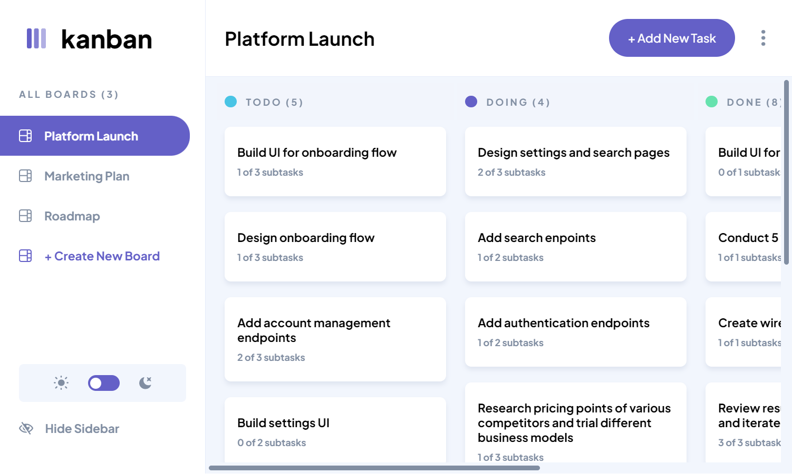
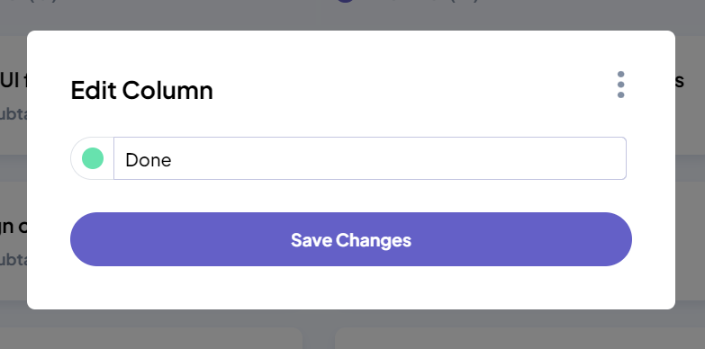
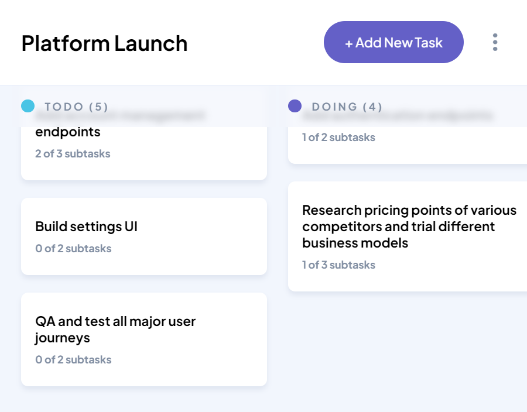
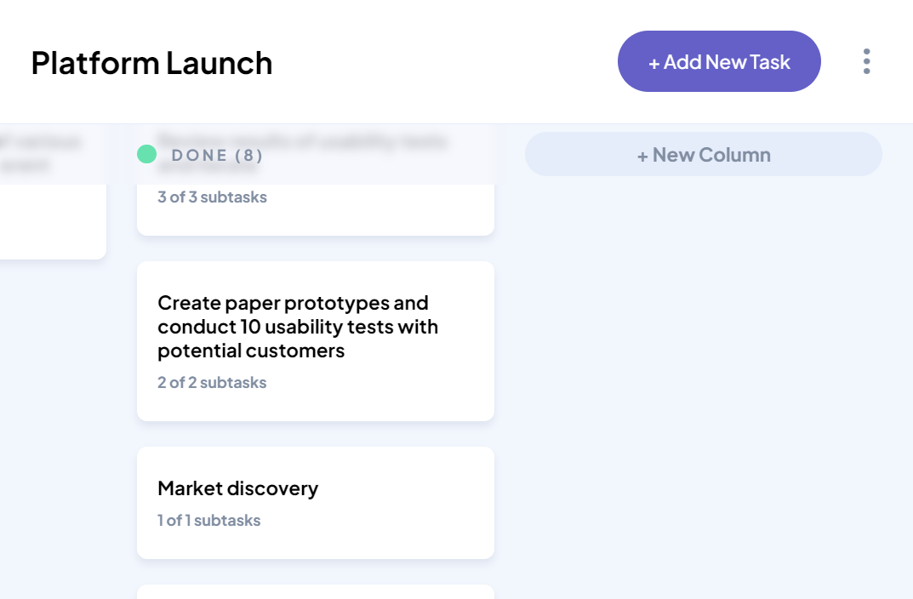
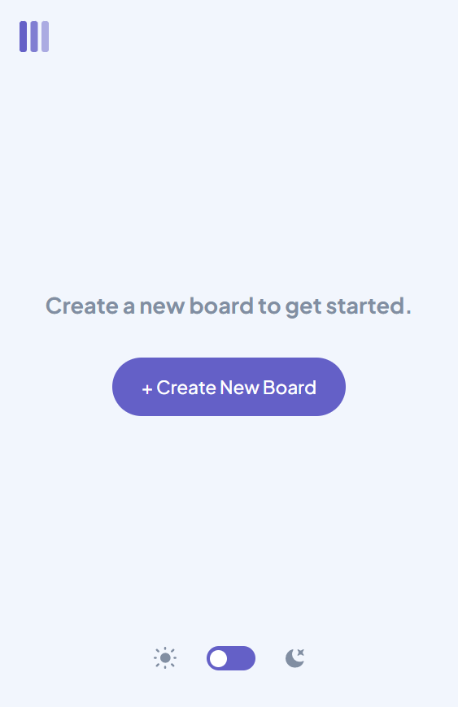
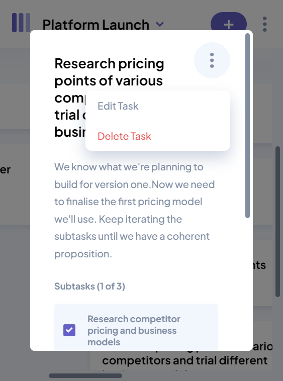
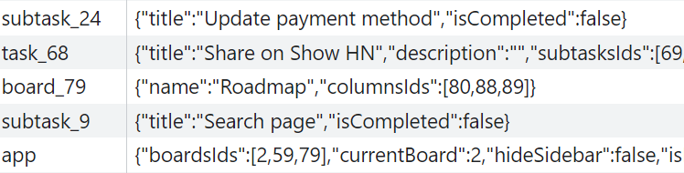
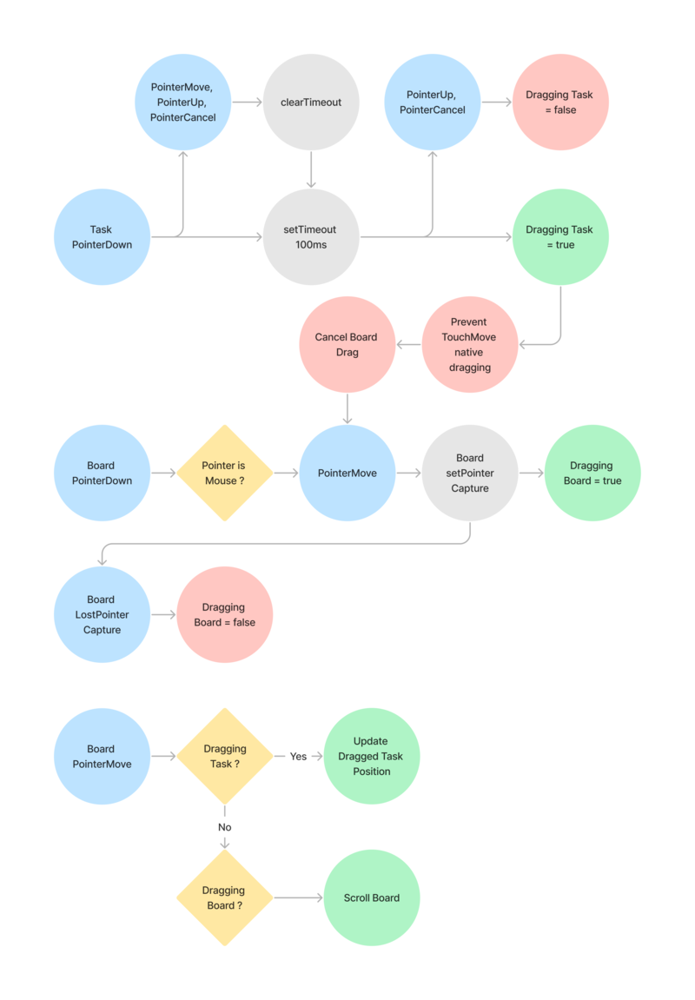
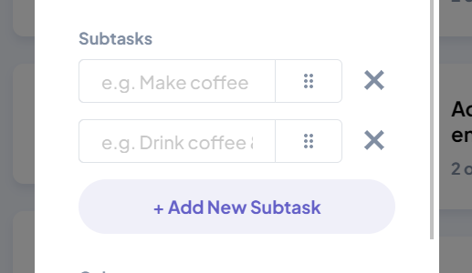
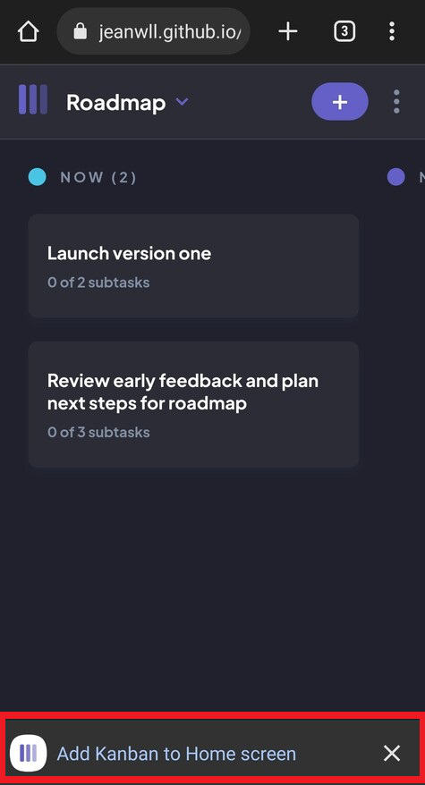

Live site: https://jeanwll.github.io/Task-Management-Web-App/



# Frontend Mentor - Kanban task management web app solution

This is a solution to the [Kanban task management web app challenge on Frontend Mentor](https://www.frontendmentor.io/challenges/kanban-task-management-web-app-wgQLt-HlbB).

## Table of contents

- [The challenge](#the-challenge)
- [Built with](#built-with)
- [Design additions and adaptation](#design-additions-and-adaptation)
  - [Column Dialog](#column-dialog)
  - [Sticky Column Names](#sticky-column-names)
  - [New Column Button](#new-column-button)
  - [Small screen without boards](#small-screen-without-boards)
  - [Dialog menu position](#dialog-menu-position)
- [Managing localStorage](#managing-localstorage)
- [Managing Pointer Events](#managing-pointer-events)
- [Drag and Drop Everywhere](#drag-and-drop-everywhere)
- [Webmanifest and Service Worker](#webmanifest-and-service-worker)
- [Continued development](#continued-development)
- [Author](#author)

### The challenge

Users should be able to:

- View the optimal layout for the app depending on their device's screen size
- See hover states for all interactive elements on the page
- Create, read, update, and delete boards and tasks
- Receive form validations when trying to create/edit boards and tasks
- Mark subtasks as complete and move tasks between columns
- Hide/show the board sidebar
- Toggle the theme between light/dark modes
- Drag and drop tasks to re-order them in a column or move them in different column
- Keep track of any changes after refreshing the browser
- Use the app offline

## Built with

- Semantic HTML5 markup
- CSS custom properties
- Flexbox
- Object Oriented JavaScript
- JS Class as Components - Same methodology as my previous project [Job listing](https://github.com/jeanwll/static-job-listings-master)
- [ArrowJS](https://www.arrow-js.com/) - Reactive UI with native JavaScript

## Design additions and adaptation

I took the initiative to rework a few of the provided rules and layout.

### Column Dialog

Project requirements mention that new columns should be created through the edit board modal, which I thought was really not an intuitive behavior.

I created a simple form dedicated to form creation/edition, and additionally providing color selection for each columns.



### Sticky Column Names

Scrolling through the tasks should be a frequent action and having the column name disappearing could be misleading.

This was a nice opportunity to use `position: sticky` and `backdrop-filter` properties.



### New Column Button

The provided design "New Column" button appearance would take too much space and be inconsistent on a scrolled board content.

Instead, I created a button that would match column names.



### Small screen without boards

The provided design relies on board name to toggle menu on small screens. However this is a conflicting feature for a situation where there is no existing boards.

I came up with a custom layout for that situation.



### Dialog menu position

The provided design shows a floating expanded dialog menu, overflowing its dialog container. However, on smaller screens, dialogs would require vertical overflow, which would be conflicting with an overflowing expanded menu.

I decided to keep the floating menu inside the dialog.



## Managing localStorage

Each Board, Column, Task and Subtask have their own localStorage key.

This keeps the saving process fast and scalable, as you don't have to stringify all data on every small changes.

```js
class Task {
    keysToSave = ['title', 'description', 'subtasksIds']

    data = reactive({
        title: '',
        description: '',
        subtasksIds: [],
        dragging: false
    })

	constructor() {
        this.storageKey = `task_${id}`
        
		for (const key of this.keysToSave) {
            data.$on(key, () => this.save())
        }
    }

	save() {
        const { data } = this
        const entries = this.keysToSave.map(key => [key, data[key]])
        const save = Object.fromEntries(entries)

        localStorage.setItem(this.storageKey, JSON.stringify(save))
    }
```



## Managing Pointer Events

Those are all the pointer related board features that should work seamlessly, cross-device, cross-browser, with any pointer type (mouse, touch, pen);

1. Drag Board Content Area to scroll, drag can start on Task Tiles and Columns Names
2. Drag Task Tiles to re-order, drag should start after 200ms pointer press
3. Auto scroll Board when dragged Task Tile reaches the border of the area
4. Drop Task Tiles confirming re-order, shouldn't open Task
5. Open Task Tiles on click
6. Open Column Form on Column Name click

Those implementations required a good amount of iteration, I attempted building a diagram to better visualize the events sequence.



## Drag and Drop Everywhere

I had the intention of providing more Drag And Drop support across the app.

I wrote a few function that were supposed to allow this feature; e.g. re-ordering subtasks directly in the form dialog.

Unfortunately I wasn't satisfied with my design addition as it greatly reduced available input space for smaller screens. Perhaps dialogs should be full screen on small screens?

I finally removed this feature.



## Webmanifest and Service Worker

There are 2 main steps for your app to become *installable*;
- Create a Webmanifest file and fill required fields
- Create a Service Worker file, register it and add a fetch listener

My Service Worker simply provides offline support.

```js
const getResp = async (request) => {
	const cache = await caches.open(cacheName)

	try {
		const resp = await fetch(request)
		
		// If online and page exists, update cache
		if (resp.ok) cache.put(request, resp.clone())

		return resp
	}
	// If offline or URL can't be reached, serve cached file
	catch {
		return await cache.match(request)
	}
}

self.addEventListener('fetch', e => {
	e.respondWith(getResp(e.request))
})
```

It's important to note that the scope of the service worker is the folder it's in, e.g. putting your Service worker at `./js/sw.js` won't be able to affect `./index.html`.



## Continued development

- Seamless data syncing across multiple devices through backend synchronization
- Pushstate functionality to improve navigation, allowing the use of the back button to navigate to previous screen (open/close modal, previous board)
- Bundling and minification to streamline performance, reducing file size, and optimizing cache
- Use View Transitions API to add visual transitions when navigating between different sections of the application

## Author

- Website - [Jean Will](https://jeanwill.me)
- Frontend Mentor - [@jeanwll](https://www.frontendmentor.io/profile/jeanwll)